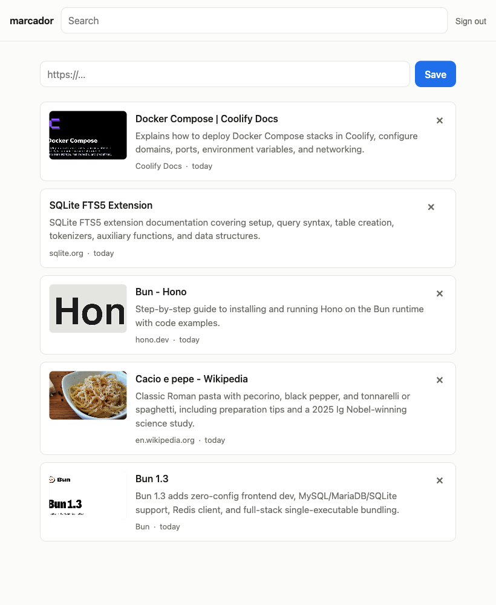

# marcador

Save a link, get a one-sentence description of it, find it again later.

A deliberately small alternative to Karakeep: one SQLite file, one container, no
queue, no worker, no browser automation. Share a link from Safari on iOS, iPadOS
or macOS and it appears in the list a second later with a title, an image, and a
sentence written by Mistral.



## What it does

- **Save a link** from the web UI, the share sheet, or `POST /api/links`
- **Describe it** — Mistral reads the page and writes one sentence
- **Show the page's image**, scraped from its OG tags
- **Full-text search** across titles, descriptions and URLs (SQLite FTS5)
- **Single-user auth** — a password for the browser, a bearer token for the share sheet

Not included, on purpose: tags, folders, page archiving, multi-user accounts,
and RSS. Each is a decision to make later rather than a gap.

## How it fits together

```
Safari share sheet ─┐
Web UI ─────────────┼─> POST /api/links ──> SQLite (status: pending)
Shortcut / curl ────┘                            │
                                                 │  returns immediately
                                                 ▼
                                    background queue (in-process, serial)
                                                 │
                                    fetch page ──┴── ask Mistral
                                                 │
                                       SQLite (status: ready)
```

The save path never waits on the network. That is the whole reason the share
sheet dismisses instantly instead of spinning for four seconds on a slow site,
and it is why a failed scrape costs you a description rather than the link.

| File | What lives there |
| --- | --- |
| `src/app.ts` | Every route, HTML and JSON alike |
| `src/store.ts` | Saving, listing, and the FTS5 search query |
| `src/enrich.ts` | The background queue |
| `src/metadata.ts` | OG-tag scraping |
| `src/summarise.ts` | The Mistral call — **and the prompt** |
| `src/auth.ts` | Session cookie and bearer token |
| `native/ShareExtension/` | The Swift share sheet |

## Running it locally

```sh
bun install
cp .env.example .env       # then fill in the two secrets
bun run dev                # http://localhost:3000
```

`MISTRAL_API_KEY` is optional. Without it links still save and still get a
title and image; the description falls back to whatever the page says about
itself.

```sh
bun test          # 38 tests, no network
bun run typecheck
```

## Deploying to Coolify

1. Push this repo somewhere Coolify can reach.
2. New resource → **Docker Compose** → point it at this repo. It picks up
   `docker-compose.yml`.
3. Set the environment variables:

   | Variable | Notes |
   | --- | --- |
   | `MARCADOR_PASSWORD` | Your web login. Required. |
   | `MARCADOR_TOKEN` | For the share sheet. `openssl rand -hex 32`. Required. |
   | `MARCADOR_SECRET` | Optional. Defaults to a value derived from the password, which means changing the password signs you out everywhere. |
   | `MISTRAL_API_KEY` | Optional, but it is the point of the app. |
   | `MISTRAL_MODEL` | Defaults to `mistral-small-latest`. |

4. Set the domain, and let Coolify terminate TLS. The session cookie marks
   itself `Secure` when it sees `X-Forwarded-Proto: https`, so this matters.
5. Health check is `GET /healthz`, already declared in the Dockerfile.

The `marcador-data` volume holds one SQLite file. Backing that file up is the
entire backup story.

## The iOS / iPadOS / macOS app

A thin Capacitor shell whose webview points at your deployment, plus a native
Share Extension. The shell exists so the extension has somewhere to live: iOS
Safari has no Web Share Target API, so a PWA can never appear in the share sheet.

```sh
cp native/ShareExtension/Config.xcconfig.example native/ShareExtension/Config.xcconfig
# edit it: your domain, and the same MARCADOR_TOKEN as the server
bun run ios
```

That regenerates `ios/`, wires the extension target in, and opens Xcode. Set
your signing team on both the **App** and **ShareExtension** targets, then run.
Choose **My Mac (Mac Catalyst)** for the Mac app — the same extension then shows
up in the macOS share menu.

Two things that will bite you if you edit the config by hand:

- **The URL needs the `https:/$()/host` escape.** xcconfig treats `//` as a
  comment and will silently truncate a normal URL to `https:`. The app now
  refuses to post rather than failing quietly, but the escape is still required.
- **`ios/` is disposable and gitignored.** Everything that makes it marcador
  lives in `capacitor.config.ts`, `native/`, and `scripts/add-share-extension.rb`.
  Never edit the generated project by hand; the next `bun run ios` deletes it.

### No Xcode?

`POST /api/links` is all the extension does, so an iOS Shortcut works too:

```
Receive URLs from share sheet
  → Get Contents of URL
      https://your-domain/api/links
      Method: POST
      Headers: Authorization = Bearer <MARCADOR_TOKEN>
      Request Body (JSON): url = Shortcut Input
```

## Migrating from Karakeep

```sh
# See what would happen, without writing anything
bun scripts/import-karakeep.ts --from https://bookmarks.example.com --key ak1_... --dry-run

# Do it
bun scripts/import-karakeep.ts --from https://bookmarks.example.com --key ak1_...
```

Get the key from Karakeep's **Settings → API Keys**. If you would rather not make
one, export from **Settings → Import & Export** and pass the file instead:

```sh
bun scripts/import-karakeep.ts --file karakeep-export.json
```

It never writes to Karakeep, and it is safe to re-run: links deduplicate on their
normalised URL, so a second pass imports only what is new.

| Option | Does |
| --- | --- |
| `--dry-run` | Reports what it would import, writes nothing |
| `--summarise missing` | Default. Keeps Karakeep's descriptions, and writes fresh ones only where there are none |
| `--summarise all` | Re-describes everything with Mistral, so the whole list reads in one voice |
| `--summarise none` | Keeps Karakeep's text as-is; no Mistral calls at all |
| `--skip-archived` | Leaves Karakeep's archived bookmarks behind |

**What comes across:** the URL, title, description, image, source site, and the
original save date — so the list keeps its order rather than all landing today.
For the description it takes your note first, then Karakeep's AI summary, then
the page's own description.

**What does not:** tags, archived state, highlights, and full-page archives.
marcador has nowhere to put them, and storing data nothing can display is worse
than leaving it behind. Karakeep is untouched, so it all stays there.

## API

All routes need either a session cookie or `Authorization: Bearer <MARCADOR_TOKEN>`.

| Route | Does |
| --- | --- |
| `POST /api/links` | `{"url": "..."}`. 201 when new, 200 when already saved. |
| `GET /api/links` | Everything, or `?q=` to search. |
| `GET /api/links/:id` | One link. Poll it to watch `status` go `pending` → `ready`. |
| `DELETE /api/links/:id` | Removes it. |
| `GET /healthz` | No auth. For Coolify. |

## License

[PolyForm Noncommercial 1.0.0](LICENSE) — same as On The Beach. Free to read,
run, modify and share for any noncommercial purpose; commercial use needs a
separate arrangement.
